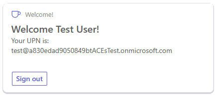

# Bot-Powered-ACE Collect Feedback

This sample shows how to create a Viva Connection Adaptive Card Extension (ACE) to authenticate the current user and to retrieve latest received email messages using Microsoft Graph. The ACE has been implemented using a Bot Powered ACE based on .NET.

Here you can see CardView of the ACE to sign-in the current user:


Here you can see the CardView that welcomes the authenticated user:




## Used Bot Framework Version

This bot has been created using [Bot Framework](https://dev.botframework.com).

## Applies to

- [Microsoft SharePoint Online](https://www.microsoft.com/en-us/microsoft-365/sharepoint/collaboration)
- [Microsoft Viva Connections](https://learn.microsoft.com/en-us/viva/connections/viva-connections-overview)

> Get your own free development tenant by subscribing to [Microsoft 365 developer program](http://aka.ms/o365devprogram)

## Solution

| Solution    | Author(s)                                               |
| ----------- | ------------------------------------------------------- |
| WelcomeUserBotPoweredAce | Paolo Pialorsi Paolo Pialorsi - [PiaSys.com](https://www.piasys.com/) - [@PaoloPia](https://twitter.com/PaoloPia) |

## Version history

| Version | Date             | Comments        |
| ------- | ---------------- | --------------- |
| 1.0     | March 06, 2024   | Initial release |

## Disclaimer

**THIS CODE IS PROVIDED _AS IS_ WITHOUT WARRANTY OF ANY KIND, EITHER EXPRESS OR IMPLIED, INCLUDING ANY IMPLIED WARRANTIES OF FITNESS FOR A PARTICULAR PURPOSE, MERCHANTABILITY, OR NON-INFRINGEMENT.**

---

## Minimal Path to Awesome

### Prerequisites

- [.NET SDK](https://dotnet.microsoft.com/download) version 6.0

  ```bash
  # determine dotnet version
  dotnet --version
  ```

### To try this sample

- In a terminal, navigate to `BotPowered_BasicAce_CollectFeedback`

    ```bash
    # change into project folder
    cd BotPowered_BasicAce_CollectFeedback
    ```

- Run the bot from a terminal or from Visual Studio, choose option A or B.

  A) From a terminal

  ```bash
  # run the bot
  dotnet run
  ```

  B) Or from Visual Studio

  - Launch Visual Studio
  - File -> Open -> Project/Solution
  - Navigate to `BotPowered-BasicAce-CollectFeedback` folder
  - Select `BotPowered-BasicAce-CollectFeedback.csproj` file
  - Press `F5` to run the project

### Deploy the bot to Azure

To learn more about deploying a bot to Azure, see [Deploy your bot to Azure](https://aka.ms/azuredeployment) for a complete list of deployment instructions.

### Further reading

- [Bot Framework Documentation](https://docs.botframework.com)
- [Bot Basics](https://docs.microsoft.com/azure/bot-service/bot-builder-basics?view=azure-bot-service-4.0)
- [Activity processing](https://docs.microsoft.com/en-us/azure/bot-service/bot-builder-concept-activity-processing?view=azure-bot-service-4.0)
- [Azure Bot Service Introduction](https://docs.microsoft.com/azure/bot-service/bot-service-overview-introduction?view=azure-bot-service-4.0)
- [Azure Bot Service Documentation](https://docs.microsoft.com/azure/bot-service/?view=azure-bot-service-4.0)
- [.NET Core CLI tools](https://docs.microsoft.com/en-us/dotnet/core/tools/?tabs=netcore2x)
- [Azure CLI](https://docs.microsoft.com/cli/azure/?view=azure-cli-latest)
- [Azure Portal](https://portal.azure.com)
- [Language Understanding using LUIS](https://docs.microsoft.com/en-us/azure/cognitive-services/luis/)
- [Channels and Bot Connector Service](https://docs.microsoft.com/en-us/azure/bot-service/bot-concepts?view=azure-bot-service-4.0)